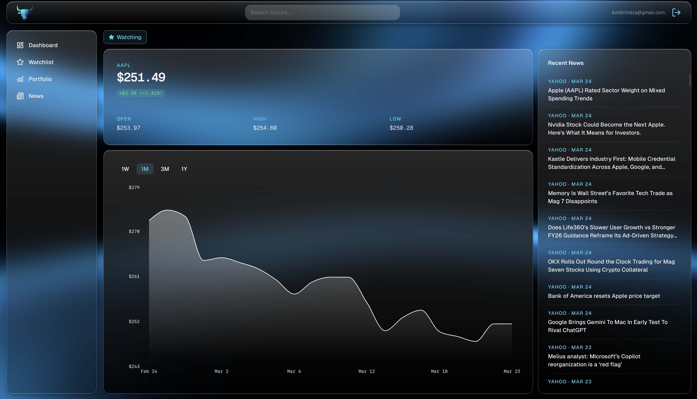
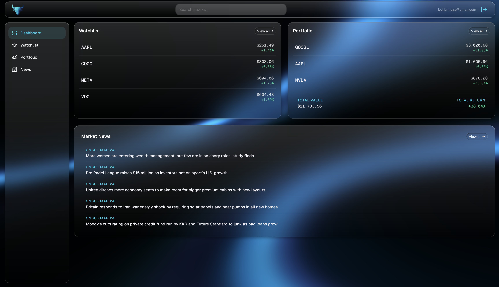
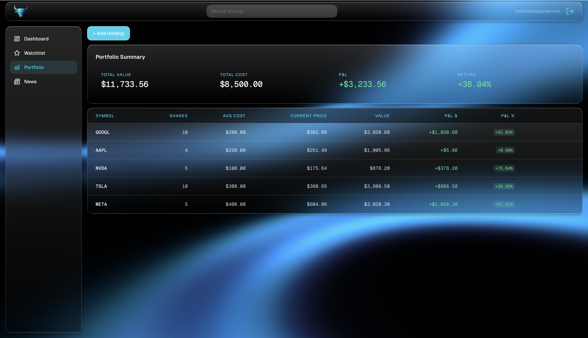
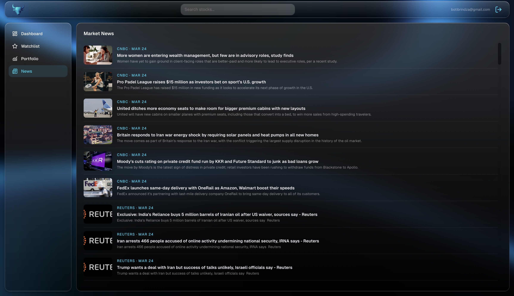

# BullStack

BullStack is a full-stack stock tracking dashboard where you can monitor live prices, track your holdings with real-time P&L, and stay on top of market news — all in one clean, fast interface. Built from scratch as a learning project, but engineered with the same patterns you'd find in a production app: server-side API proxying, in-memory caching, session-authenticated routes, and a custom design system.



---

## Tech Stack

[](https://nextjs.org/)
[](https://www.typescriptlang.org/)
[](https://tailwindcss.com/)
[](https://railway.app/)
[](https://www.prisma.io/)
[](https://authjs.dev/)
[](https://finnhub.io/)
[](https://recharts.org/)
[](https://tanstack.com/query)
[](https://zod.dev/)
[](https://vercel.com/)

---

## Features

- **Authentication** — Email/password and Google OAuth via NextAuth v5, middleware-protected routes
- **Stock Search** — Debounced autocomplete search by symbol or company name
- **Stock Detail** — Live quote, interactive price chart (1W / 1M / 3M / 1Y), per-stock news feed, add to watchlist
- **Watchlist** — Personal watchlist with live quotes and change percentages; full table and dashboard widget views
- **Portfolio** — Track holdings with real-time P&L calculations; add/remove positions with average cost tracking
- **Market News** — General market headlines feed with article links; 2-hour server-side cache
- **Dashboard** — Overview with portfolio summary, watchlist widget, and latest news
- **Skeleton loaders** — Every data-fetching component shows a shimmer placeholder that matches its real layout, eliminating layout shift
- **Mobile responsive** — Bottom tab navigation on small screens, sidebar on desktop; stock page and portfolio table scroll correctly on mobile

---

## Project Structure

```
bullstack/
├── app/
│   ├── (auth)/                    # Centered card layout — login, register
│   ├── (dashboard)/               # Sidebar layout — all protected pages
│   │   ├── dashboard/             # Overview: portfolio summary + watchlist + news
│   │   ├── watchlist/             # Full watchlist with live quotes
│   │   ├── portfolio/             # Holdings table with P&L
│   │   ├── stocks/[symbol]/       # Chart, quote card, news, add to watchlist
│   │   └── news/                  # Market-wide news feed
│   └── api/
│       ├── auth/[...nextauth]/    # NextAuth handler
│       ├── user/register/         # POST — create new user
│       ├── watchlist/             # GET + POST; [symbol]/ DELETE
│       ├── portfolio/             # GET + POST; [id]/ PUT + DELETE
│       └── stocks/[symbol]/       # quote/, candles/, profile/, news/; search/; market-news/
├── components/
│   ├── ui/                        # Skeleton (shimmer loading placeholder)
│   ├── auth/                      # LoginForm, RegisterForm
│   ├── stock/                     # StockSearchBar, StockQuoteCard, StockChart, StockNewsFeed
│   ├── watchlist/                 # WatchlistTable, WatchlistWidget, AddToWatchlistButton
│   ├── portfolio/                 # HoldingTable, PortfolioSummaryCard, PortfolioWidget, AddHoldingModal
│   ├── news/                      # NewsCard, NewsWidget
│   ├── layout/                    # Sidebar, BottomNav, Topbar, UserMenu
│   └── providers/                 # ReactQueryProvider
├── lib/
│   ├── auth.ts                    # NextAuth v5 config
│   ├── prisma.ts                  # Prisma singleton (globalThis pattern)
│   ├── finnhub.ts                 # Finnhub API wrapper with in-memory TTL cache
│   ├── yahoo.ts                   # yahoo-finance2 candles, normalized to Finnhub shape
│   ├── cache.ts                   # Map-based TTL cache utility
│   ├── api.ts                     # Client-side fetch wrappers
│   └── utils.ts                   # cn(), formatCurrency(), formatPercent()
├── hooks/
│   ├── useWatchlist.ts            # React Query hook for watchlist CRUD
│   └── usePortfolio.ts            # React Query hook for portfolio CRUD
├── types/
│   ├── finnhub.ts                 # Finnhub API response types
│   ├── portfolio.ts               # App-level types with computed P&L fields
│   └── next-auth.d.ts             # Adds user.id to Session type
├── prisma/schema.prisma
└── middleware.ts                  # Protects all (dashboard) routes
```

---

## Getting Started

### Prerequisites

- Node.js 18+
- A PostgreSQL database ([Railway](https://railway.app/) recommended)
- Finnhub API key — [finnhub.io/dashboard](https://finnhub.io/dashboard)
- Google OAuth credentials (optional, for Google sign-in)

### Environment Variables

Create a `.env.local` file in the project root:

```env
DATABASE_URL=           # Railway PostgreSQL connection string
NEXTAUTH_URL=           # http://localhost:3000
NEXTAUTH_SECRET=        # openssl rand -base64 32
GOOGLE_CLIENT_ID=
GOOGLE_CLIENT_SECRET=
FINNHUB_API_KEY=        # from finnhub.io/dashboard
```

### Install and Run

```bash
pnpm install
npx prisma migrate dev --name init
pnpm dev
```

Open [http://localhost:3000](http://localhost:3000).

---

## Architecture Notes

### API Key Security

All Finnhub calls are server-side only — the API key never reaches the browser. Every client-side data fetch goes through a Next.js API route which validates the session before proxying to Finnhub.

### Caching

Responses are cached in-memory with TTL (`lib/cache.ts`). Bad or empty responses from Finnhub are not cached — only valid, non-empty data is stored.

| Data | TTL |
|---|---|
| Quote | 60 s |
| Candles (1W / 1M) | 30 min |
| Candles (3M / 1Y) | 6 h |
| Company profile | 24 h |
| Stock news | 2 h |
| Market news | 2 h |
| Symbol search | 5 min |

### Historical Price Data

Finnhub's `/stock/candle` endpoint is premium-tier only. Historical OHLC data is sourced from `yahoo-finance2` (free, no key required) and normalized to the `FinnhubCandles` shape so all downstream chart code is unaffected.

### Database

PostgreSQL on Railway via Prisma 7. Uses `@prisma/adapter-pg` driver adapter (required for Prisma 7). All money and quantity fields use `Decimal` (not `Float`) to avoid floating-point precision issues.

---

## Current Status

### Completed

**Phase 1 — Project Setup**
Next.js 14 App Router scaffolded, connected to Railway PostgreSQL, deployed to Vercel.

**Phase 2 — Authentication**
Email/password registration with Zod validation and bcryptjs hashing. Google OAuth via NextAuth v5. Server Actions for auth forms. Middleware protects all dashboard routes.

**Phase 3 — Stock Data**
Live quotes via Finnhub (60s cache). Historical candles via `yahoo-finance2`. Debounced symbol search autocomplete. Area chart with 1W / 1M / 3M / 1Y resolution switcher.

**Phase 4 — Watchlist**
Personal watchlist with live quotes and % change. Full table and dashboard widget. Optimistic mutations via TanStack Query. Clickable rows navigate to the stock detail page.

**Phase 5 — Portfolio Tracking**
Holdings table with Symbol, Shares, Avg Cost, Current Price, Value, P&L $ and P&L %. Add/remove positions via modal. Portfolio summary card (total value, total return). Dashboard widget shows top holdings. Clickable rows navigate to the stock detail page.

**Phase 6 — News Feed**
Per-stock news on the stock detail page. General market headlines on `/news`. 2-hour server-side cache. Clickable articles open in a new tab.

**Phase 7 — Polish & Responsive**
Shimmer skeleton loaders on all data-fetching components. Error states via React Query `isError`. Mobile-responsive layout with bottom tab navigation. Stock chart adapts tick density and Y-axis position on mobile. Holdings table horizontally scrollable on mobile.

### Upcoming

**Deployment**
Add env vars to Vercel, set Google OAuth redirect URIs to production URL, run `npx prisma migrate deploy` against Railway production DB, end-to-end test with a fresh account.

---

## Additional Screenshots




